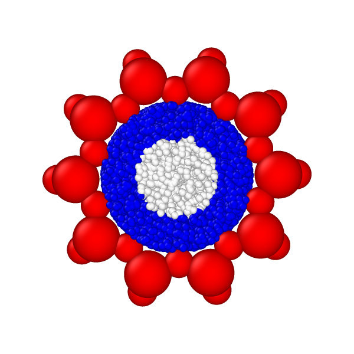
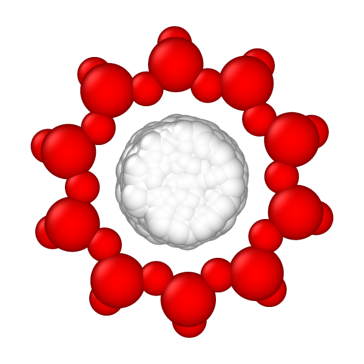

# Creating a figure to visualize the inside and outside points

In this example I create a figure like the one below:



Beware that the more points you put in your figure, the more RAM you'll need! In this example I'm using 10000, that in this case is enough, but if I try 100000, I end up using more than my 16 Gb of RAM.

Using the files in this folder, follow the steps:
1. run `volume.in` to get the interaction energies
2. grep the interaction energies with
```bash
grep "Loop time of" volume.out -B1 --no-group-separator | grep -v "Loop time of" | awk '{print $3}' > inten.txt
```
3. using **the same** `rngs.txt` run `volume_traj.in`, which will generate the `debug.lammpstrj`
4. use the `concat_in_out_traj.py` script to get the last configuration from `debug.lammpstrj` (which contains all the inserted Ne atoms) and color accordingly
```bash
python ../concat_in_out_traj.py debug.lammpstrj inten.txt > colored.lammpstrj
```
5. open `colored.lammpstrj` with ovito, add a "Color coding" modification and color the atoms by the "inside" property.
6. to have a better visualization you can reduce the radii of the Ne atoms

If you wish, you can also generate a figure without the "out" points.



The process is similar to the above, but in step 5, run the `python` script with the `--only-in` option:
```bash
python ../concat_in_out_traj.py debug.lammpstrj inten.txt --only-in > colored2.lammpstrj
```
